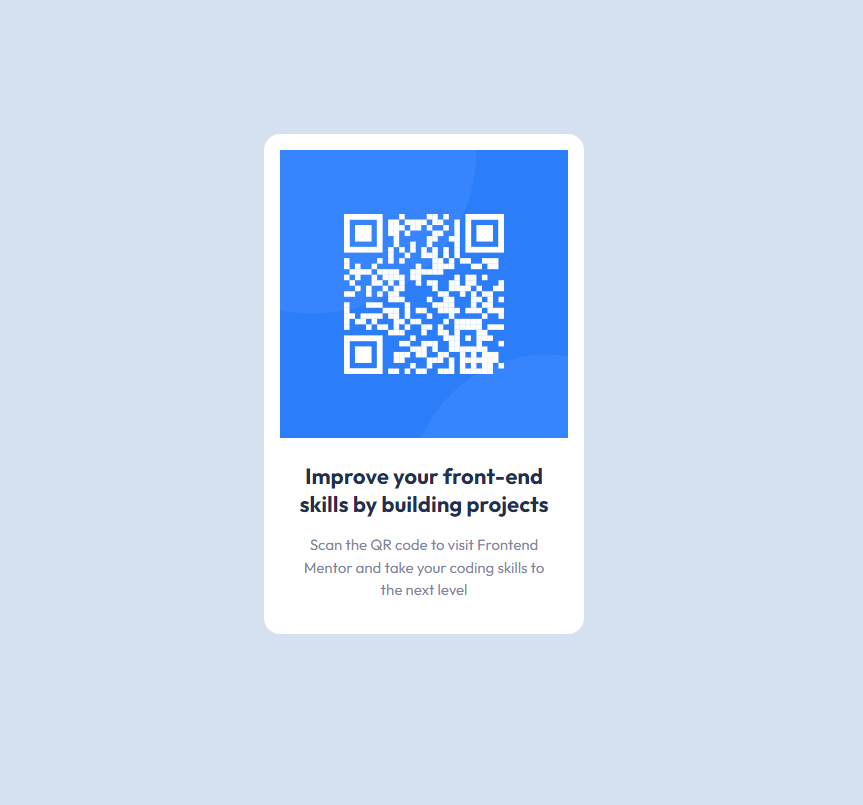

# Frontend Mentor - QR code component solution

This is a solution to the [QR code component challenge on Frontend Mentor](https://www.frontendmentor.io/challenges/qr-code-component-iux_sIO_H). Frontend Mentor challenges help you improve your coding skills by building realistic projects.

## Table of contents

- [Overview](#overview)
  - [Screenshot](#screenshot)
  - [Links](#links)
- [My process](#my-process)
  - [Built with](#built-with)
  - [Useful resources](#useful-resources)
- [Author](#author)

## Overview

### Screenshot

#### Web

#### Mobile

### Links

- Solution URL: [Solution](https://www.frontendmentor.io/solutions/responsive-qr-code-component-DaMnVUiQQy)
- Live Site URL: [Vercel](https://fm-q-rcode-component.vercel.app/)

## My process

### Built with

- Semantic HTML5 markup
- Flexbox
- Mobile-first workflow
- [React](https://reactjs.org/) - JS library
- [Vite](https://vitejs.dev/) - Development Environment
- [Tailwind](https://tailwindcss.com/) - CSS Framework

### Useful resources

- [Tailwind Documentation](https://tailwindcss.com/docs) - Tailwind as always has a very rich documentation with a lot of examples on all the classes.

## Author

- Frontend Mentor - [@DevMaktubi](https://www.frontendmentor.io/profile/DevMaktubi)
- LinkedIn - [Breno Luiz](https://www.linkedin.com/in/breno-luiz)
